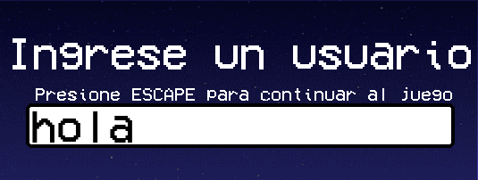
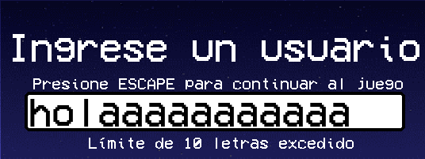

# LOGO GAME
## Inicio de aplicacion:
Al iniciar la aplicación, se establece una resolución de 1280x720 píxeles. La ventana muestra el logo del videojuego junto con un botón de "Play", diseñado para iniciar y avanzar a la siguiente fase del juego. En la barra de título de la ventana, se puede ver el nombre del juego junto al logo.

## Registrarse en el juego:
Al seleccionar Play, lo dirigirá a la siguiente pantalla, en la cual deberá ingresar el nombre de usuario con el que quiera identificarse para registrar su récord. 

Para avanzar, deberá tocar la tecla ESC como lo indica en la ventana cuando comienza a escribir

El nombre debe contener por lo menos un caracter y como máximo, puede tener 10. En caso de no ingresar ningun caracter o ingresar más de 10, el juego no le permitirá continuar. 

## Fuentes:
