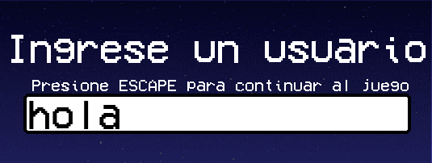
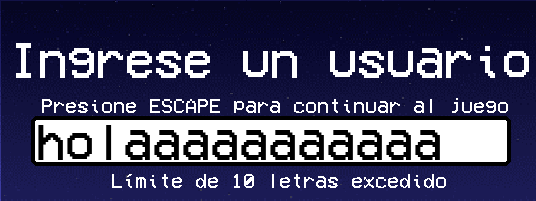

# LOGO GAME 
## Introduccion:
La mecánica de este videojuego es sencilla: se presentan 4 logos, de los cuales 3 son incorrectos y 1 es el correcto. El jugador debe seleccionar cuidadosamente la opción correcta para ganar 20 monedas y superar los récords de monedas de otros usuarios. Si el jugador elige incorrectamente, perderá un corazón y 10 monedas. Además, también se puede perder si transcurren 30 segundos sin seleccionar una opción.

## Inicio de aplicacion:
Al iniciar la aplicación, se establece una resolución de 1280x720 píxeles. La ventana muestra el logo del videojuego junto con un botón de "Play", diseñado para iniciar y avanzar a la siguiente fase del juego. En la barra de título de la ventana, se puede ver el nombre del juego junto al logo.

## Registrarse en el juego:
Al seleccionar Play, lo dirigirá a la siguiente pantalla, en la cual deberá ingresar el nombre de usuario con el que quiera identificarse para registrar su récord. 

Para avanzar, deberá tocar la tecla ESC como lo indica en la ventana cuando comienza a escribir

<strong> Posible error </strong>
El nombre debe contener por lo menos un caracter y como máximo, puede tener 10. En caso de no ingresar ningun caracter o ingresar más de 10, el juego no le permitirá continuar. 

## Comienzo del juego:

El participante verá en pantalla 4 versiones similares del logo de una marca, pero solo uno de ellos es el correcto. Debe hacer click sobre la opción que cree correcta. Tiene 30 segundos para completar la ronda. En caso de no seleccionar una respuesta antes del tiempo indicado, se pasará automáticamente a la siguiente ronda, se le descontará una vida y 10 monedas. El objetivo es completar las 15 rondas manteniendo vidas y con la mayor cantidad de monedas posible.

### Elementos del juego:
<strong> Vidas </strong>

El participante cuenta con un total de 5 vidas, representadas con los corazones que se visualizan en el sector izquierdo superior de la pantalla, que se irán descontando de a una con cada error, o con el cumplimiento del tiempo límite de cada ronda (30 segundos). Al quedarse sin vidas, se termina la partida.

<strong> Monedas </strong>

Con cada acierto que el jugador tenga, se le sumarán 20 monedas, mientras que con cada equivocación, se le descontarán 10. En caso de cumplirse los 30 segundos, también se descuentan 10 monedas 

     

## Fin del juego:

Al finalizar el juego, ya sea porque el participante complete las 15 rondas o porque se quede sin vidas, aparecerá en pantalla la siguiente imagen, con la información de cuál fue el tiempo promedio utilizado para cada respuesta, con cuántas monedas finalizó la partida, y si superó el record de monedas, o sigue perteneciendo a otra persona.

 

## Documentacion:
https://www.pygame.org/docs/
