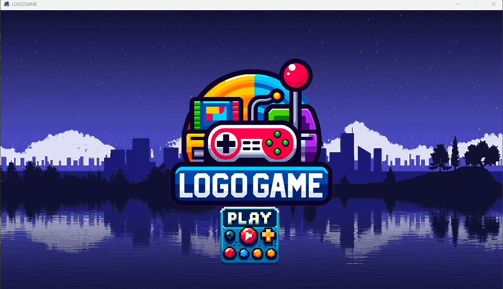
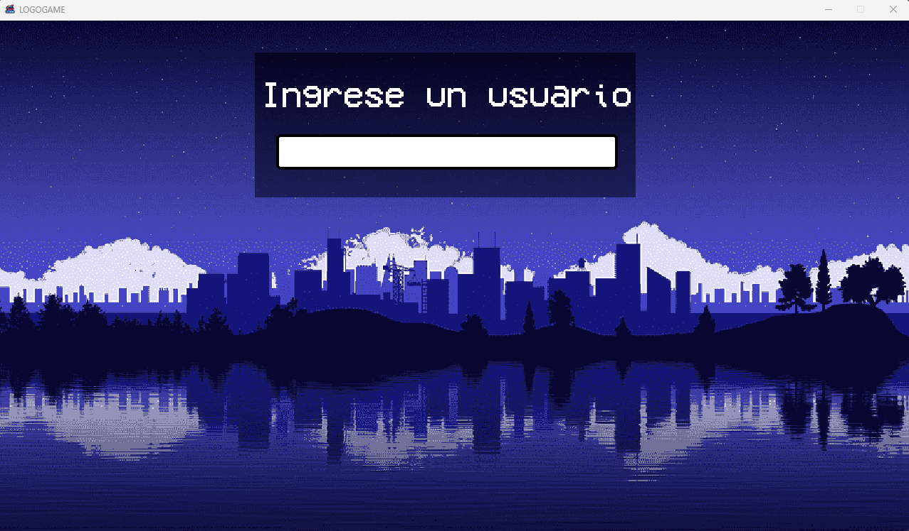
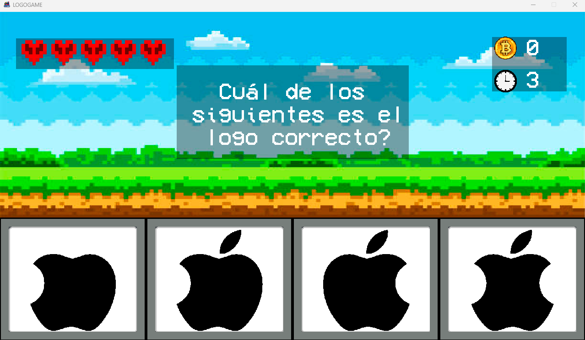
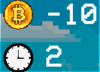
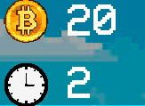
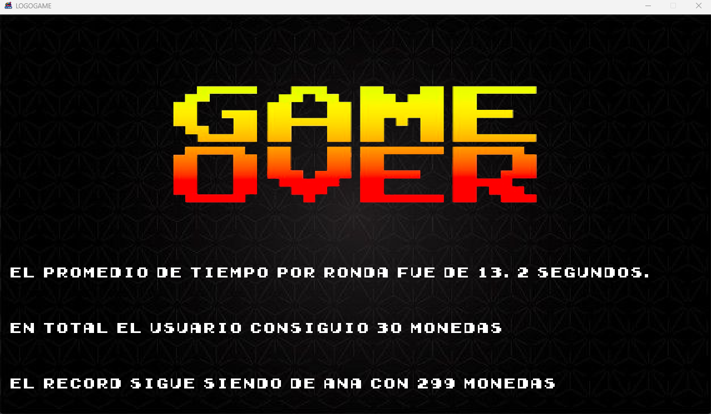

# LOGO GAME
Inicio de aplicacion:
Al iniciar la aplicación, se establece una resolución de 1280x720 píxeles. La ventana muestra el logo del videojuego junto con un botón de "Play", diseñado para iniciar y avanzar a la siguiente fase del juego

 

